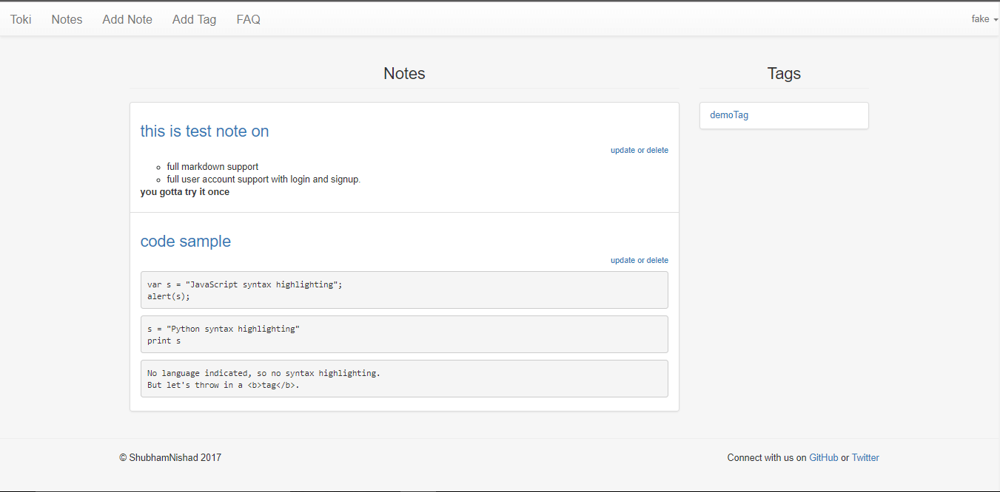

# toki-keep-a-note
a simple note taking app made with Django.
##### 

Toki is a simple note taking Django project. It was developed to act as a Hands-on and increase my experience with a MVC framework(MTV as in the case of Django).

##### 

project link: http://shubhamnishad97.pythonanywhere.com/

I was interested in Django from the first time I searched about and after a little investigation I choose Django as the base for this project.

## Features of Toki - keep a Note

*   customize notes using the markdown editor.You dont need to know markdown, the editor will help you.
*   You can Rename, Save, Update, Delete notes.
*   support for code blocks and highlighting
*   Fully responsive. use any device and always find the best layout.

## Things I like about Django.

*   Lots and lots of quality packages
*   Full featured web framework
*   Great community support and excellent documentation
*   Really good ORM. It was really easy to work with DB.
*   You can very quickly make a functional web app when you want to test your ideas.

## Things I Learned

*   Working with a MVC or you can say MTV.
*   By doing this project I came to know how Django works and what powers does it has.
*   integrating differnt packages into a single project
*   Database operations on a RDBMS
*   hosting and configuring the project on pythonanwhere.com

## Resources/packages used

*   [django-crispy-forms](http://django-crispy-forms.readthedocs.io/en/latest/): it makes your forms way more beautiful or I should say crispy.
*   [virtualenv](https://virtualenv.pypa.io/en/stable/): its a no-brainer.
*   [django-pagedown](https://github.com/timmyomahony/django-pagedown): provides easy editor for markdown input.
*   many other packages are used, for them do check the requirement file.[link](https://github.com/shubhamnishad97/toki-keep-a-note/blob/master/requirements.txt): 

## How to run the project locally

1.   make sure you have python,pip and virtualenv installed.
2.   make a virtualenv and download the repo inside it.(you can skip the virtualenv part if you like).
3.   activate the virtualenv. I have already included the packages in the repo along with db.
4.   cd toki and execute python manage.py runserver.
5.   that's it the site will be running.
6.   note:-if you get any package errors, re-install them using the requirements.txt file.

 
 
 
 

